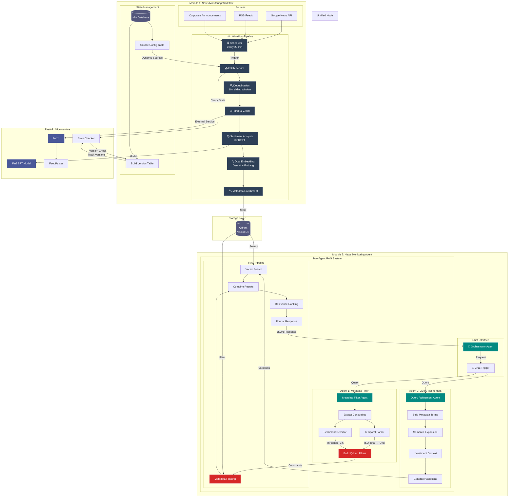
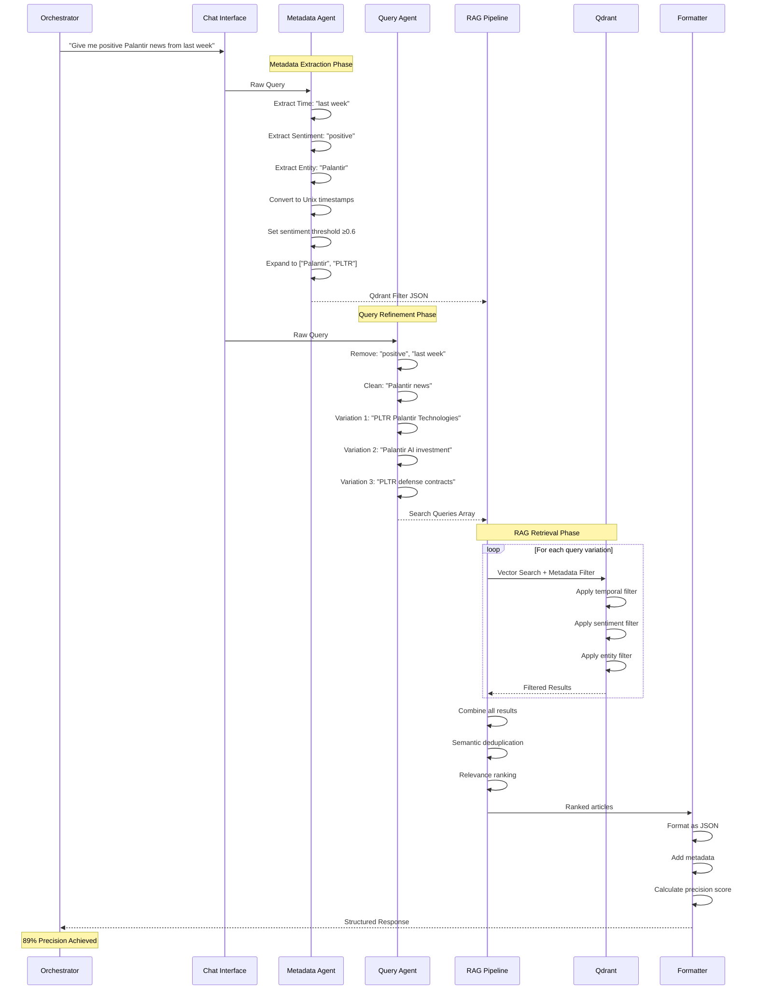
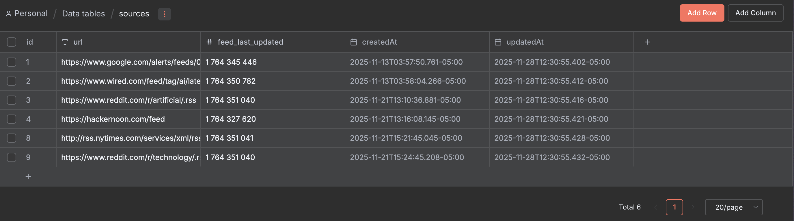

# Mycroft News Monitoring Agent 🤖📰

An intelligent news aggregation and analysis system that monitors AI and technology news, performs sentiment analysis, and provides RAG-based querying capabilities. Part of the larger Mycroft multi-agent orchestration framework.

## The What

The News Monitoring Agent automatically reads thousands of news articles then filters out the noise to show only what matters to you - essentially acting as an intelligent assistant that reads everything so you don't have to.

## The Why

The Information Overload Problem

- **Volume**: ~500,000 articles published daily across professional sources
- **Noise**: 85% is redundant, promotional, or irrelevant to your specific needs
- **Fragmentation**: Important updates scattered across dozens of platforms
- **Speed**: By the time you manually find critical news, competitors already acted on it

### [Watch on YT](https://youtu.be/DJMgFMDmDto?si=zik3HYPcKZZ_Fiml)

## 🏗️ Architecture Overview



### RAG Agent Sequence



## 🚀 Quick Start

### Prerequisites

- Docker & Docker Compose
- Google Gemini API key
- HuggingFace API token

### Installation

1. **Clone the repository**

```bash
git clone https://github.com/Humanitariansai/Mycroft.git
cd Mycroft/Core_Components/news_monitoring_agent
```

2. **Set up environment variables**

```bash
cp .env.example .env
# Edit .env with your API keys:
# GOOGLE_GEMINI_API_KEY=your_key_here
# HUGGINGFACE_TOKEN=your_token_here
# QDRANT_API_KEY=set-your-own
```

3. **Start infrastructure services**

```bash
docker compose up
```

4. **Initial setup in n8n**

- Access n8n at `http://localhost:5678`
- Import `workflows/news_monitoring_agent.json`
- Configure credentials for Qdrant, Postgres, Google Gemini and HuggingFace
- Run all Util nodes
- Activate the workflow

## 📁 Project Structure

```
news_monitoring_agent/
├── workflows/
│   └── news_monitoring_agent.json    # n8n workflow definition
├── webserver/                        # FastAPI microservice
│   ├── main.py                       # API endpoints
│   ├── utils.py                      # Core processing logic
│   └── sources.toml                  # RSS feed configuration
├── docker-compose.yml                # Service orchestration
├── .env.example                      # Environment template
└── README.md
```

## 🔧 Configuration

### RSS Feed Sources as Configuration in n8n

Use n8n internal data table to declare the sources.



Keep feed_last_updated field empty for new sources

### Pipeline Settings

- **Schedule**: Modify in n8n workflow (default: 30 minutes)
- **Batch Size**: Set in workflow nodes (default: 30 embeddings/batch)
- **Deduplication Window**: 10,000 items (configurable in Remove Duplicates node)

## 🛠️ Core Components

### 1. News Helper Service (FastAPI)

Provides Python-based processing capabilities:

```python
# Endpoints
POST /fetch?lib=googlenews    # Fetch from Google News
POST /fetch?lib=feedparser    # Fetch from RSS feeds
POST /parse                   # Parse article content
POST /finbert?article=...     # Sentiment analysis
GET  /health                  # Health check
```

### 2. Processing Pipeline

**Ingestion → Parsing → Deduplication → Enrichment → Storage**

- **Fetching**: Google News API + RSS feedparser
- **Parsing**: Newspaper3k library for content extraction
- **Deduplication**: URL and title-based matching
- **Sentiment**: FinBERT model for financial sentiment
- **Embeddings**: Dual strategy (Gemini + FinLang)

### 3. Vector Storage

**Qdrant**

- Collection: `news_articles_a` (FinLang embeddings)
- Collection: `news_articles_b` (Gemini embeddings)
- Hybrid search with metadata filtering

### 4. RAG Agent

Chat interface with:

- Prompt enhancing with `Metaprompt Agentv2`
- Query Filtering using Metadata with `Metadata Agentv2`
- Multi-source vector search
- Conversation memory (PostgreSQL)
- Streaming responses

## 📈 Metrics & Monitoring

The system tracks:

- **Ingestion Volume**: Articles fetched per cycle
- **Unique Rate**: Percentage of non-duplicate content
- **Processing Success**: Articles successfully enriched
- **Signal Rate**: End-to-end efficiency
- **Loss Rate**: Failed processing percentage

View metrics:

Run the `View metrics` node in n8n

or run this sql on postgreSQL container

```sql
select
  start_time::DATE as "date",
  sum(ingested) as ingested_total,
  sum(deduplicated) as unique_items,
  sum(processed) as processed_total,
  round((sum(deduplicated) - sum(processed)::decimal) * 100 / sum(deduplicated), 2) as loss_percentage,
  round(sum(processed)::decimal * 100 / sum(ingested), 2) as signal_percentage
from
  metrics
group by
  start_time::DATE
order by
  "date";
```

### Optimization Priorities

1. ✅ Persistent deduplication database
2. ⏳ Content-based hashing for semantic deduplication
3. ⏳ Retry logic with exponential backoff
4. ⏳ Source quality scoring
5. 🔄 Graph RAG implementation
6. 💬 Event-based architecture for dynamic compute redistribution

## 🧪 Testing

### Unit Tests

```bash
cd webserver && pytest
```

## 📊 Key Performance Indicators

| Component       | Metric       | Current   | Target  |
| --------------- | ------------ | --------- | ------- |
| URL Cleaning    | Success Rate | 99%       | 99%     |
| Article Parsing | Success Rate | 90%       | 95%     |
| Deduplication   | method       | key based | 90%     |
| FinBERT         | Throughput   | 50/min    | 100/min |
| Latency         | p95          | 1.2       | 200ms   |

### Development Setup

```bash
# Install dev dependencies
cd webserver && uv sync
```

## 📧 Contact

- **Author**: Ashish Nevan Gade
- **Email**: nevchris242@gmail.com
- **Project**: Mycroft
- **LinkedIn**: [ashishnevan](https://linkedin.com/in/ashishnevan)

## 🙏 Acknowledgments

- FinBERT by ProsusAI for sentiment analysis
- FinLang for finance-specific embeddings
- n8n community for workflow automation
- Newspaper3k for reliable article parsing

---

**Note**: This is an active research project. Performance metrics and architecture may change as optimizations are implemented.
