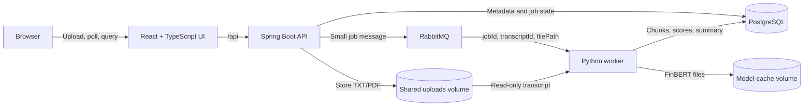

# Earnings Call Sentiment Analyzer

An explainable, production-style MVP for analyzing earnings-call transcripts. Upload a TXT or text-based PDF, let the asynchronous FinBERT pipeline identify speakers and call sections, and review percentage-based sentiment signals with the exact transcript evidence behind them.

## What the application does

- Accepts earnings transcripts as `.txt` or text-based `.pdf` files up to 10 MB.
- Detects prepared remarks, Q&A, guidance, financial-results, and unknown sections.
- Detects common transcript speaker layouts, including standalone names, titled headers, timestamps on separate lines, and `Speaker Name 00:02:00` headers.
- Classifies speakers as CEO, CFO, analyst, operator, other, or unknown.
- Splits the transcript into small, auditable evidence chunks.
- Scores every chunk with [`ProsusAI/finbert`](https://huggingface.co/ProsusAI/finbert).
- Reports overall, section, management, analyst, and speaker-level net tone.
- Shows guidance tone, risk-language frequency, management confidence, and the supporting evidence.
- Runs analysis asynchronously so uploads do not block on model inference.

## Architecture



### Service responsibilities

| Service | Responsibility |
| --- | --- |
| Frontend | Upload form, job polling, dashboard, charts, research signals, and evidence browser |
| Spring Boot API | Input validation, file storage, job creation, queue publishing, and read APIs |
| RabbitMQ | Durable asynchronous delivery between the API and worker |
| Python worker | Text extraction, structure parsing, chunking, FinBERT inference, and summary calculation |
| PostgreSQL | Transcript metadata, job state, evidence chunks, probabilities, and summaries |
| Shared upload volume | Makes the uploaded file available to both the API and worker without putting it on the queue |
| Hugging Face volume | Retains the downloaded FinBERT model between container restarts |

The transcript body is never sent through RabbitMQ. The message contains only job identifiers, transcript metadata, and the shared-volume file path.

### Analysis flow

1. The API validates the file and metadata.
2. The file is stored in the shared uploads volume.
3. PostgreSQL records the transcript and a `QUEUED` analysis job.
4. The API publishes a small message to RabbitMQ and immediately returns the IDs.
5. The worker changes the job to `PROCESSING`, extracts text, and detects sections and speakers.
6. The worker creates one-to-three-sentence evidence chunks and scores them in batches with FinBERT.
7. Chunks, probabilities, aggregates, and the final `COMPLETED` state are saved in one transaction.
8. The worker acknowledges the RabbitMQ delivery only after the database commit succeeds.

```text
QUEUED -> PROCESSING -> COMPLETED
                     -> FAILED
```

## Technology stack

| Layer | Technologies |
| --- | --- |
| Frontend | React 18, TypeScript, Vite, Tailwind CSS, TanStack Query, Axios, Recharts |
| API | Java 21, Spring Boot 3.3, Spring Web, Spring Data JPA, Flyway, Spring AMQP |
| Worker | Python 3.11, PyTorch, Transformers, FinBERT, pdfplumber, psycopg, pika |
| Infrastructure | PostgreSQL 16, RabbitMQ 3.13, Nginx, Docker Compose |

## Quick start with Docker

### Prerequisites

- Docker Desktop, or Docker Engine with the Compose plugin
- Approximately 4 GB of available RAM
- Several GB of free disk space for Docker images and the model cache

You do **not** need to install Java, Maven, Python, Node.js, PostgreSQL, or RabbitMQ when using Docker.

### 1. Start the complete stack

From the project root:

```bash
docker compose up -d --build
```

The first worker start downloads FinBERT and may take several minutes. Later starts reuse the named model-cache volume.

### 2. Check service health

```bash
docker compose ps
docker compose logs -f backend worker
```

Wait for the backend to report healthy and for the worker log to say that it is waiting for analysis jobs.

### 3. Open the application

| Service | URL | Credentials |
| --- | --- | --- |
| Web application | [http://localhost:5173](http://localhost:5173) | None |
| API health | [http://localhost:8080/actuator/health](http://localhost:8080/actuator/health) | None |
| RabbitMQ management | [http://localhost:15672](http://localhost:15672) | `sentiment` / `sentiment` |

Upload [`sample-data/sample-transcript.txt`](sample-data/sample-transcript.txt) to run a small test analysis.

### 4. Stop or reset the stack

Stop containers while preserving the database, uploads, queue data, and model cache:

```bash
docker compose down
```

Delete containers **and all project data volumes**:

```bash
docker compose down -v
```

Delete the project data and all images used by the Compose services:

```bash
docker compose down -v --rmi all --remove-orphans
```

Container deletion alone does not delete named Docker volumes. Use `-v` when you intentionally want to remove PostgreSQL data, RabbitMQ data, uploaded transcripts, and the FinBERT cache.

To inspect Docker disk usage:

```bash
docker system df
```

`docker builder prune -f` can remove unused build cache, but it affects Docker globally rather than only this project.

## How sentiment is calculated

FinBERT returns positive, neutral, and negative probabilities for every evidence chunk.

```text
chunk net tone = positive probability - negative probability
group net tone = arithmetic mean of its chunk net tones
displayed percentage = group net tone x 100
```

The range is `-100%` to `+100%`:

- Above `+5%`: **Positive**
- From `-5%` through `+5%`: **Neutral**
- Below `-5%`: **Negative**

For example, an overall net tone of `+31%` means positive probability exceeded negative probability by 31 percentage points per chunk on average. It does **not** mean that 31% of sentences were positive, and it is not a forecast of stock performance.

### Dashboard metrics

| Metric | Population being averaged |
| --- | --- |
| Overall net tone | Every evidence chunk in the transcript |
| Prepared tone | Chunks detected as prepared remarks |
| Q&A tone | Chunks detected as question-and-answer discussion |
| Management tone | Chunks spoken by detected CEOs and CFOs |
| Analyst tone | Chunks spoken by detected analysts |
| Speaker tone | Chunks attributed to the named speaker |

Overall and section-aware values answer different questions. The overall metric is weighted naturally by the number of chunks in each section. Prepared-vs-Q&A and management-vs-analyst comparisons expose tone differences that the transcript-wide average can hide.

### Research signals

- **Guidance tone:** uses a dedicated guidance section when detected; otherwise it clearly identifies prepared remarks as a proxy.
- **Risk language:** reports the percentage of chunks that combine a negative FinBERT label with configured risk terms and cites the strongest matching passage.
- **Management confidence:** interprets CEO/CFO net tone together with the difference between Q&A and prepared tone.

These are research prompts, not investment recommendations. Always verify a signal against the displayed transcript evidence.

## Supported input formats

### TXT

UTF-8 plain text is supported. Explicit section and speaker headings improve results:

```text
PREPARED REMARKS

Jane Smith - Chief Executive Officer:
Revenue grew 18 percent and customer retention remained strong.

QUESTION AND ANSWER SESSION

Chris Lee - Equity Research Analyst:
What changed in the renewal pipeline?
```

The parser also supports common vendor layouts such as:

```text
Jane Smith
President and CEO at Example Corp
00:02:00
Prepared remarks begin here.
```

and:

```text
Jane Smith 00:02:00
President and CEO at Example Corp
Prepared remarks begin here.
```

### PDF

Text-based PDFs are extracted with `pdfplumber`. Web-page exports and conventional earnings-transcript layouts are supported, including participant rosters and timestamped speakers.

Scanned or image-only PDFs require OCR and are not supported by this MVP. If text cannot be selected in a PDF viewer, convert it with OCR before uploading.

## API reference

All application endpoints are under `/api`.

### Upload a transcript

`POST /api/transcripts` using `multipart/form-data`:

| Field | Type | Validation |
| --- | --- | --- |
| `file` | file | Non-empty `.txt` or `.pdf`; maximum 10 MB |
| `companyName` | string | Required; maximum 200 characters |
| `ticker` | string | 1-20 letters, numbers, dots, or dashes |
| `quarter` | string | `Q1`, `Q2`, `Q3`, or `Q4` |
| `fiscalYear` | integer | 1990 through two years after the current year |

Example:

```bash
curl -X POST http://localhost:8080/api/transcripts \
  -F file=@sample-data/sample-transcript.txt \
  -F 'companyName=Northstar Cloud Systems' \
  -F ticker=NCS \
  -F quarter=Q3 \
  -F fiscalYear=2026
```

Response:

```json
{
  "transcriptId": 1,
  "jobId": 1,
  "status": "QUEUED"
}
```

### Read endpoints

| Method | Path | Purpose |
| --- | --- | --- |
| `GET` | `/api/jobs/{jobId}` | Job status, progress, worker message, and failure detail |
| `GET` | `/api/transcripts` | Newest-first transcript library |
| `GET` | `/api/transcripts/{transcriptId}` | Transcript metadata and status |
| `GET` | `/api/transcripts/{transcriptId}/sentiment/summary` | Overall and cohort metrics plus label counts |
| `GET` | `/api/transcripts/{transcriptId}/sentiment/chunks` | Evidence text, attribution, probabilities, labels, and net tone |
| `GET` | `/api/transcripts/{transcriptId}/sentiment/sections` | Section-level aggregates |
| `GET` | `/api/transcripts/{transcriptId}/sentiment/speakers` | Speaker-level aggregates |

## Data model

| Table | Purpose |
| --- | --- |
| `transcripts` | Company metadata, stored file path, and overall processing status |
| `analysis_jobs` | Queue-facing state, progress, messages, errors, and timestamps |
| `transcript_chunks` | Ordered source evidence with section, speaker, role, and text |
| `sentiment_results` | FinBERT probabilities, label, net tone, and model name per chunk |
| `sentiment_summaries` | Transcript-level and cohort-level aggregate metrics |

Flyway owns schema creation and migrations. Hibernate validates the schema at startup rather than modifying it.

## Configuration

Docker Compose provides working development defaults. Override these values for other environments.

### Backend

| Variable | Docker value | Local default |
| --- | --- | --- |
| `DB_URL` | `jdbc:postgresql://postgres:5432/earnings_sentiment` | `jdbc:postgresql://localhost:5432/earnings_sentiment` |
| `DB_USERNAME` | `postgres` | `postgres` |
| `DB_PASSWORD` | `postgres` | `postgres` |
| `RABBITMQ_HOST` | `rabbitmq` | `localhost` |
| `RABBITMQ_PORT` | `5672` | `5672` |
| `RABBITMQ_USERNAME` | `sentiment` | `guest` |
| `RABBITMQ_PASSWORD` | `sentiment` | `guest` |
| `UPLOAD_DIR` | `/uploads` | `./uploads` |

### Worker

| Variable | Docker value | Local default |
| --- | --- | --- |
| `DB_HOST` | `postgres` | `localhost` |
| `DB_PORT` | `5432` | `5432` |
| `DB_NAME` | `earnings_sentiment` | `earnings_sentiment` |
| `DB_USER` | `postgres` | `postgres` |
| `DB_PASSWORD` | `postgres` | `postgres` |
| `RABBITMQ_HOST` | `rabbitmq` | `localhost` |
| `RABBITMQ_PORT` | `5672` | `5672` |
| `RABBITMQ_USERNAME` | `sentiment` | `guest` |
| `RABBITMQ_PASSWORD` | `sentiment` | `guest` |
| `UPLOAD_DIR` | `/uploads` | `./uploads` |
| `MODEL_NAME` | `ProsusAI/finbert` | `ProsusAI/finbert` |
| `MODEL_BATCH_SIZE` | `16` | `16` |

The credentials in `docker-compose.yml` are intended for local development. Use secrets and non-default credentials for a deployed environment.

## Run services without Docker

Docker Compose is the recommended path. For service-level development, install Java 21, Maven 3.9+, Python 3.11, and Node.js 20+.

Start only infrastructure:

```bash
docker compose up -d postgres rabbitmq
```

### Backend

```bash
cd backend
RABBITMQ_USERNAME=sentiment \
RABBITMQ_PASSWORD=sentiment \
mvn spring-boot:run
```

### Worker

The backend and worker must reference the same upload directory.

```bash
cd worker
python3 -m venv .venv
source .venv/bin/activate
pip install -r requirements.txt

PYTHONPATH=. \
UPLOAD_DIR=../backend/uploads \
RABBITMQ_USERNAME=sentiment \
RABBITMQ_PASSWORD=sentiment \
python -m app.main
```

### Frontend

```bash
cd frontend
npm ci
npm run dev
```

The Vite development server proxies `/api` to `http://localhost:8080`. The Docker image uses Nginx for the same routing behavior.

## Tests and validation

Worker parsing and path-safety tests:

```bash
cd worker
PYTHONPATH=. python -m unittest discover -s tests -v
```

Backend build and tests:

```bash
cd backend
mvn test
```

Frontend type-check, production build, and lint:

```bash
cd frontend
npm run build
npm run lint
```

Full container build:

```bash
docker compose build
```

### Current validation status

This repository now demonstrates that the end-to-end approach works on representative transcripts, but it is still an MVP rather than a statistically benchmarked research platform.

Validated examples in this codebase workstream:

- FedEx Q4 2026 TXT transcript: parsed and scored successfully with zero `unknown` speakers after parser fixes.
- Apogee Q1 2027 PDF transcript: parsed and scored successfully with zero `unknown` speakers after PDF-layout handling fixes.
- H.B. Fuller Q2 2026 PDF transcript: initially failed because the vendor format placed speaker names and timestamps on the same line; the parser was extended and the transcript then completed successfully with zero `unknown` speakers.

Verification completed during development:

- Worker parser tests passed after the transcript-layout fixes.
- Frontend build and lint passed after the dashboard and contract changes.
- Docker images built successfully for the full stack.
- UI verification confirmed that evidence, speaker attribution, and percentage-based tone metrics rendered correctly for the validated transcripts.

What is still missing for a stronger research-grade validation package:

- No formal speaker-attribution accuracy benchmark against a labeled corpus yet.
- No latency or throughput benchmark suite yet.
- No structured user-feedback study yet.
- No historical backtest connecting extracted signals to downstream market or fundamentals outcomes yet.

## Contribution status against success criteria

### Present in this repository

- Comprehensive architecture, data-flow, configuration, and deployment documentation.
- Production-style MVP code with asynchronous processing, retries, durable queueing, logging, path-safety checks, schema validation, and parser tests.
- Working prototype that demonstrates core transcript-ingestion, parsing, scoring, and evidence-review functionality.
- Evaluation hooks that allow repeatable testing through worker fixtures, backend tests, frontend build checks, and end-to-end transcript verification.
- Documentation of major limitations, operational behavior, and next steps.

### Partially present

- Validation exists for known transcript samples, but not yet as a broad quantitative benchmark.
- Reliability work is present, but monitoring is still operationally light. There is logging, but not a full metrics/dashboard/tracing stack.
- The system is suitable for local and MVP deployment, but not yet for multi-tenant production deployment.

### Not yet present

- Formal performance benchmarks with published targets and repeatable measurement scripts.
- User-feedback summaries or analyst workflow studies.
- A backtesting framework that measures whether extracted signals predict external outcomes.
- Authentication, authorization, tenant isolation, retention governance, and dead-letter operations expected in a larger shared deployment.

## Integration considerations for Mycroft

This project is shaped as a reusable intelligence service rather than a standalone toy application.

- The Spring Boot API can act as an ingestion and query layer for other Mycroft systems.
- The worker already produces structured chunk-level evidence, speaker attribution, section tags, probabilities, and transcript summaries that can feed downstream retrieval, ranking, or report-generation workflows.
- The parser and scoring stages are separable, which makes it practical to swap in OCR, a different finance model, or a richer extraction layer without changing the UI contract.
- The evidence-first design is compatible with RAG workflows because every aggregate is backed by persisted transcript chunks that can be retrieved, cited, and filtered by section or speaker.

Likely Mycroft extension paths:

- Store transcript chunks and structured signals in a shared retrieval index for cross-call search.
- Join earnings-call signals with company, sector, or portfolio metadata from existing Mycroft systems.
- Add period-over-period comparison so analyst workflows can track tone shifts across quarters.
- Generate structured research briefs from the saved evidence and section-aware metrics.

## Reliability and security decisions

- RabbitMQ messages are durable and manually acknowledged.
- Worker prefetch is limited to one job so CPU-heavy analyses are not overcommitted.
- Completed jobs are idempotent: duplicate queue deliveries are acknowledged and skipped.
- A retry replaces prior chunks and summaries transactionally.
- Database connectivity failures are requeued instead of being marked as permanent analysis failures.
- Upload paths are normalized and constrained to the configured upload directory.
- The API validates metadata, extension, content presence, and request size.
- API and worker containers run as non-root users.
- Chunk-level probabilities and source text are retained for auditability.

## Troubleshooting

### The worker is running but jobs stay queued

The first start may still be downloading FinBERT. Check:

```bash
docker compose logs -f worker
docker compose ps
```

Also confirm RabbitMQ and the backend are healthy.

### A PDF produces no analyzable text

The PDF is probably scanned or image-only. Try selecting and copying text in a PDF viewer. If that fails, run OCR and upload the OCR-enabled version.

### Speakers appear as unknown

Speaker detection is rule-based. Preserve speaker names, roles, timestamps, section headings, and participant rosters when preparing the transcript. If a new vendor uses a repeatable layout, add a parser fixture in `worker/tests/test_text_processing.py` before extending the parser.

### Ports are already in use

The default host ports are `5173`, `8080`, `5432`, `5672`, and `15672`. Stop the conflicting service or change the left-hand port in `docker-compose.yml`.

### Start from an empty database and model cache

```bash
docker compose down -v
docker compose up -d --build
```

The next worker start will download FinBERT again.

## Project structure

```text
.
├── backend/
│   ├── Dockerfile
│   ├── pom.xml
│   └── src/main/
│       ├── java/com/earningssentiment/
│       └── resources/db/migration/
├── frontend/
│   ├── Dockerfile
│   ├── nginx.conf
│   └── src/
├── worker/
│   ├── Dockerfile
│   ├── requirements.txt
│   ├── app/
│   └── tests/
├── sample-data/
├── docker-compose.yml
└── README.md
```

## Current limitations

- Speaker and section detection is rule-based rather than a separate trained diarization model.
- Scanned PDFs require external OCR.
- FinBERT measures financial-language tone, not truthfulness, valuation, earnings quality, or future returns.
- Research-signal interpretations use transparent heuristics and should be validated against evidence.
- CPU inference favors portability over maximum throughput.
- Authentication, tenant isolation, object storage, retention policies, and dead-letter operations are outside this MVP.

## Critical analysis

### What worked

- The evidence-chunk architecture made debugging practical because every aggregate could be traced back to transcript text.
- Separating API ingestion from worker inference kept the stack responsive and made failures easier to isolate.
- Rule-based parsing, while imperfect, handled a surprisingly wide range of real transcript layouts once participant rosters, timestamps, and vendor-specific headers were normalized.
- Percentage-based net-tone presentation was easier to interpret than raw FinBERT logits or opaque composite scores.

### What failed or proved fragile

- Speaker attribution broke on layout variations faster than sentiment scoring did.
- PDF support was only reliable for text-based files; image-only exports remain outside scope.
- Transcript-level averages can hide meaningful differences between prepared remarks and Q&A if section-aware comparisons are not surfaced explicitly.
- FinBERT sentiment alone is not enough to claim business insight without evidence-backed interpretation and domain heuristics.

### What I would do differently next

- Build a labeled parser-evaluation corpus earlier instead of relying mainly on ad hoc transcript debugging.
- Add OCR and vendor-specific adapters sooner, because ingestion reliability is the biggest determinant of downstream quality.
- Add metrics, traces, and benchmark scripts alongside the first working version so operational quality is measurable, not inferred.
- Treat guidance extraction, risk-language detection, and confidence signals as separately testable modules with explicit acceptance criteria.

## Generalization potential

The overall pattern should generalize beyond earnings calls:

- Other financial transcripts such as investor days, conference presentations, and macroeconomic press conferences.
- Other expert-document domains where section-aware tone and cited evidence matter, such as legal hearings, policy briefings, or clinical conference transcripts.
- RAG-oriented systems that need structured evidence slices instead of only whole-document embeddings.

What does not generalize automatically:

- Speaker-role inference rules are domain- and vendor-specific.
- FinBERT is specialized for financial language and should not be assumed to transfer cleanly to unrelated domains.
- Research-signal heuristics such as management confidence and guidance tone require domain-specific calibration.

## Ethical considerations

- Tone analysis can be over-interpreted as truthfulness, competence, or investment advice when it is only a language signal. The UI and documentation should continue to distinguish those clearly.
- Transcript errors, OCR errors, or speaker-attribution mistakes can create misleading summaries, so evidence visibility and auditability are essential.
- If used in a larger organization, access controls and retention policies matter because transcripts and generated signals may be commercially sensitive.
- Users should be encouraged to review source evidence before acting on any signal, especially risk-language and confidence interpretations.

## Logical next steps

- Add OCR and DOCX ingestion.
- Add explicit parser adapters and fixtures for more transcript vendors.
- Add model/parser versioning and safe reprocessing controls.
- Add period-over-period comparisons and exportable research reports.
- Move uploads to S3-compatible object storage with retention policies.
- Add a dead-letter queue, publisher outbox, metrics, and distributed tracing.
- Add authentication and tenant isolation before multi-user deployment.
