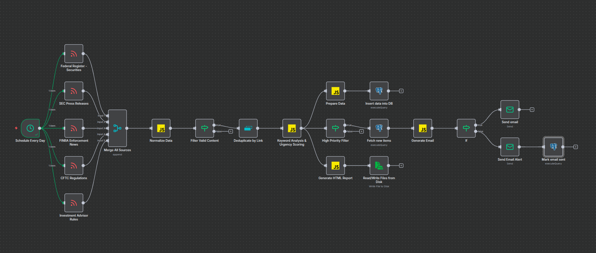

# Regulatory Intelligence System

> **Developed by:** Darshan Rajopadhye (rajopadhye.d@northeastern.edu)

[](https://linkedin.com/in/darshanrajopadhye)
[](https://github.com/Humanitariansai)

## Overview

The Financial Regulatory Intelligence System is a specialized component within the Mycroft AI Agent ecosystem that automates regulatory monitoring and analysis from SEC, FINRA, CFTC, and Federal Register sources. This n8n workflow transforms regulatory updates into actionable intelligence by systematically extracting, analyzing, and prioritizing financial compliance information with AI-powered urgency scoring.

As part of the larger Mycroft AI Agent project, this tool serves as a critical compliance intelligence component, providing real-time regulatory monitoring capabilities and enforcement action tracking that power strategic compliance decision-making processes.

## What Does This Workflow Do?

**Input:** Automated daily monitoring at 10:00 AM (configurable schedule)

**Output:** Complete regulatory intelligence package including:
- Real-time email alerts for critical/high-priority items
- Comprehensive HTML daily digest with visual analytics
- PostgreSQL database storage for historical analysis
- Urgency scoring and impact classification
- Keyword-based categorization across 6 regulatory domains



## Information Flow

```
Daily Schedule (10:00 AM)
    ↓
[5 Regulatory RSS Feeds] → Fetch Updates
    ↓
Raw Regulatory Documents
    ↓
┌──────────────────┬──────────────────┐
│   Data           │   Intelligence   │
│   Processing     │   Analysis       │
│                  │                  │
│ • Normalize      │ • Keyword Match  │
│ • Filter         │ • Urgency Score  │
│ • Deduplicate    │ • Impact Level   │
│ • Extract Meta   │ • Category Flag  │
│ • Validate       │ • Deadline Det.  │
└──────────────────┴──────────────────┘
    ↓
PostgreSQL Storage + HTML Report + Priority Email Alerts
```

## Installation & Setup

### Step 1: Setup PostgreSQL Database
See [DATABASE_SETUP.md](./DATABASE_SETUP.md) for complete table schema and setup instructions.

```bash
# Create database and table
psql -U your_user -d postgres -f DATABASE_SETUP.md
```

### Step 2: Import n8n Workflow
1. Copy the contents of `Mycroft - Financial Regulatory Intelligence System.json`
2. In your n8n instance, navigate to **Workflows** → **Import from File/URL**
3. Paste the workflow JSON or upload the file
4. Click **Import**

### Step 3: Configure Credentials
- **PostgreSQL**: Add your database connection in n8n credentials
- **SMTP**: Configure email server settings (see [n8n email documentation](https://docs.n8n.io/integrations/builtin/core-nodes/n8n-nodes-base.emailsend/))

### Step 4: Customize Settings
Update the following in workflow nodes:
- **Email addresses**: Change recipient in `Send Email Alert` and `Send email` nodes
- **Schedule time**: Modify trigger in `Schedule Every Day` node (default: 10:00 AM)

### Step 5: Activate & Test
- Click **Active** toggle in workflow editor
- Run manual execution to test setup
- Verify email delivery and database writes

## Workflow Features

### Stage 1: Data Collection & Aggregation
**What happens:** The workflow monitors multiple authoritative regulatory sources
- **Connects to:** 5 parallel RSS feeds (SEC, FINRA, CFTC, Federal Register)
- **Retrieves:** Latest regulatory documents, press releases, and enforcement actions
- **Captures:** Full metadata including titles, links, publication dates, content
- **Validates:** Feed responses and data completeness
- **Information flow:** Scheduled trigger → Raw regulatory documents from 5 sources

### Stage 2: Data Normalization & Quality Control
**What happens:** Standardizes and cleanses incoming data
- **Normalizes:** Field names and data structures across different feed formats
- **Identifies:** Source feeds using link patterns and title analysis
- **Filters:** Removes items with empty titles or content
- **Deduplicates:** Eliminates duplicate entries using link URLs as unique identifiers
- **Timestamps:** Adds scraped_at metadata for tracking
- **Information flow:** Raw documents → Validated, deduplicated records

### Stage 3: Intelligent Analysis & Classification
**What happens:** Applies AI-powered keyword analysis and urgency scoring
- **Categorizes:** Across 6 keyword domains (enforcement, compliance, crypto, securities, derivatives, fraud)
- **Scores:** Urgency levels (1-10) based on regulatory indicators
- **Classifies:** Impact levels (Critical, High, Medium, Low)
- **Detects:** Compliance deadlines and time-sensitive requirements
- **Flags:** Enforcement actions and fraud-related content
- **Calculates:** Word counts and content metrics
- **Information flow:** Clean records → Analyzed data with urgency/impact metadata

### Stage 4: Data Persistence & Reporting
**What happens:** Stores processed data and generates comprehensive reports
- **Stores:** All records in PostgreSQL with full metadata and analysis results
- **Handles:** Conflicts using upsert logic (updates existing records on link collision)
- **Generates:** Beautiful HTML reports with charts and visual breakdowns
- **Creates:** Source distribution analytics and category summaries
- **Saves:** Reports to disk for archival and LLM analysis
- **Information flow:** Analyzed data → Database + HTML report file

### Stage 5: Priority Alert System
**What happens:** Intelligently delivers notifications based on priority
- **Queries:** Database for unsent high-priority items from last 24 hours
- **Decides:** Whether to send "All Clear" status or "Priority Alert" email
- **Formats:** Professional HTML emails with color-coded priority sections
- **Includes:** Critical items (red), High priority items (orange), with urgency scores
- **Tracks:** Email delivery status in database to prevent duplicate notifications
- **Cleans up:** Marks items as emailed with timestamp
- **Information flow:** Priority items → Conditional email notification → Database update

## Input Requirements

| Input Type | Required | Default | Description |
|------------|----------|---------|-------------|
| **Schedule Time** | Yes | 10:00 AM Daily | Cron trigger for automated execution |
| **PostgreSQL Connection** | Yes | N/A | Database credentials for data storage |
| **SMTP Credentials** | Yes | N/A | Email server for notifications (see [n8n docs](https://docs.n8n.io/integrations/builtin/core-nodes/n8n-nodes-base.emailsend/)) |
| **Notification Email** | Yes | N/A | Recipient address for alerts |
| **RSS Feed URLs** | Yes | Pre-configured | 5 regulatory data source endpoints |


## Configuration Options

To modify the monitoring behavior, adjust these settings in the workflow nodes:

**Schedule Trigger:**
- Change execution time in `Schedule Every Day` node (default: 10:00 AM daily)
- Modify to hourly, weekly, or custom cron expression

**Email Recipients:**
- Update `toEmail` parameter in `Send Email Alert` node
- Update `toEmail` parameter in `Send email` node (all clear notifications)

**Urgency Thresholds:**
Modify in `Keyword Analysis & Urgency Scoring` node:
```javascript
// Current impact level thresholds
if (urgencyScore >= 9 || isFraud) return 'Critical';
if (urgencyScore >= 7 || isEnforcement) return 'High';
if (urgencyScore >= 5) return 'Medium';
return 'Low';
```

**Keyword Categories:**
Add or modify categories in `Keyword Analysis & Urgency Scoring` node:
```javascript
const keywordCategories = {
  enforcement: ['enforcement', 'penalty', 'fine', 'violation'],
  compliance: ['compliance', 'audit', 'examination', 'reporting'],
  crypto: ['cryptocurrency', 'crypto', 'bitcoin', 'blockchain'],
  // Add your custom categories here
};
```

**Priority Filter:**
Adjust email trigger criteria in `High Priority Filter` node (default: urgency > 7 OR impact in ['Critical', 'High'])


## License

MIT License - See repository for full license text

## Support

For issues, questions, or contributions:
- **Email:** rajopadhye.d@northeastern.edu
- **GitHub Issues:** [Mycroft Repository Issues](https://github.com/Humanitariansai/Mycroft/issues)
