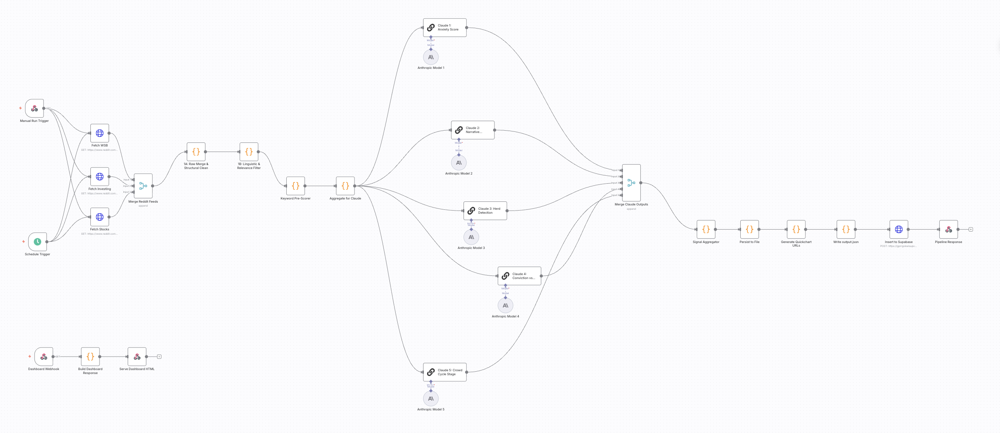

# Retail Investor Anxiety Index

A behavioral intelligence dashboard that analyzes Reddit 
crowd sentiment across r/wallstreetbets, r/investing, and 
r/stocks using multiple AI-powered signals.

Built with n8n, Claude AI, Supabase, and Chart.js.



---

## What It Does

Every 6 hours the pipeline:
1. Fetches 75 Reddit posts across 3 subreddits
2. Cleans and scores each post using keyword analysis
3. Runs 5 parallel Claude AI analysis calls
4. Stores results in Supabase
5. Serves a live dashboard via n8n webhook

## Signals

| Signal | Description |
|---|---|
| Anxiety Index | Fear/greed score 0-100 per post and subreddit |
| Narrative Velocity | Fastest rising topics this run vs last run |
| Herd Detection | Tickers/themes appearing across all 3 subreddits |
| Conviction vs Uncertainty | Assertive vs hedging language ratio |
| Crowd Cycle Stage | Market psychology: Euphoria/Complacency/Anxiety/Denial/Panic/Hope |

---

## Tech Stack

| Layer | Tool |
|---|---|
| Workflow automation | n8n |
| AI scoring | Claude Sonnet (Anthropic API) |
| Data storage | Supabase (PostgreSQL) |
| Dashboard | Vanilla JS + Chart.js |
| Charts | Chart.js 4.4 |

---

## Prerequisites

- Node.js 18+
- n8n installed globally
- Anthropic API key
- Supabase account (free tier works)

---

## Setup

### 1. Install n8n
```bash
npm install -g n8n
npx n8n
```
Open http://localhost:5678

### 2. Set up Supabase
1. Create a free project at supabase.com
2. Run this SQL in the SQL Editor:

```sql
create table anxiety_runs (
  id uuid default gen_random_uuid() primary key,
  created_at timestamptz default now(),
  date text,
  timestamp text,
  post_count integer,
  anxiety_score integer,
  subreddit_scores jsonb,
  top3_fearful_posts jsonb,
  narrative_velocity jsonb,
  herd_detection jsonb,
  conviction jsonb,
  cycle_stage jsonb,
  anxiety_chart_url text,
  velocity_chart_url text,
  herd_chart_url text,
  conviction_chart_url text,
  herd_tickers jsonb,
  conviction_score integer,
  uncertainty_score integer,
  conviction_ratio float,
  dominant_post_titles jsonb
);

alter table anxiety_runs disable row level security;
```

3. Copy your Project URL and anon public key from 
   Project Settings → API

### 3. Import Workflow
1. Open http://localhost:5678
2. Go to Workflows → Import from file
3. Select workflow.json
4. Add credentials:
   - Anthropic API key → named "Anthropic account 3"
5. Update Supabase credentials in "Insert to Supabase" node:
   - Replace YOUR_SUPABASE_ANON_KEY with your key
   - Replace YOUR_SUPABASE_URL with your project URL
6. Update dashboard.html Supabase credentials:
   - Replace SUPABASE_URL and SUPABASE_KEY with your values
7. Update "Build Dashboard Response" node with 
   updated dashboard.html content
8. Toggle workflow Active

### 4. Run the Pipeline
Click Execute Workflow from Schedule Trigger
Wait ~60 seconds for all nodes to complete

### 5. View Dashboard
```
http://localhost:5678/webhook/dashboard
```

---

## URLs

| URL | Purpose |
|---|---|
| http://localhost:5678/webhook/dashboard | View live dashboard |
| http://localhost:5678/webhook/run-pipeline | Trigger fresh run on demand |

---

## Workflow Architecture

```
PATH 1 — Dashboard (serves HTML)
GET /webhook/dashboard
  → Build Dashboard Response
  → Serve Dashboard HTML

PATH 2 — Scheduled (every 6 hours, silent)
Schedule Trigger
  → Fetch WSB + Investing + Stocks (parallel)
  → Merge Reddit Feeds
  → 1A: Raw Merge & Structural Clean
  → 1B: Linguistic & Relevance Filter
  → Keyword Pre-Scorer
  → Aggregate for Claude
  → Claude 1-5 (parallel)
      Claude 1: Anxiety Score
      Claude 2: Narrative Velocity
      Claude 3: Herd Detection
      Claude 4: Conviction vs Uncertainty
      Claude 5: Crowd Cycle Stage
  → Merge Claude Outputs
  → Signal Aggregator
  → Persist to File
  → Generate Quickchart URLs
  → Write output.json
  → Insert to Supabase
  → Check Trigger Type → ends

PATH 3 — On-demand (manual trigger)
GET /webhook/run-pipeline
  → same pipeline as Path 2
  → Pipeline Response (returns JSON confirmation)
```

---

## Dashboard Panels

1. **Anxiety Index** — Score + 7-day trend line + subreddit breakdown
2. **Crowd Cycle Stage** — Stage wheel + confidence + reasoning
3. **Conviction vs Uncertainty** — Donut chart + dominant narratives
4. **Narrative Velocity** — Top 10 rising topics horizontal bar
5. **Herd Detection** — Cross-subreddit grouped bar chart
6. **Subreddit History** — 7-day multi-line chart
7. **Conviction History** — 7-day area chart
8. **Most Fearful Posts** — Top 3 posts with fear scores

---

## Notes

- Dashboard auto-refreshes every 30 minutes
- Historical charts populate after 2+ days of runs
- n8n must be running for webhook URLs to work
- Supabase stores last 100 runs (free tier limit)
- Reddit API requires no authentication for public feeds

---

## License

MIT
