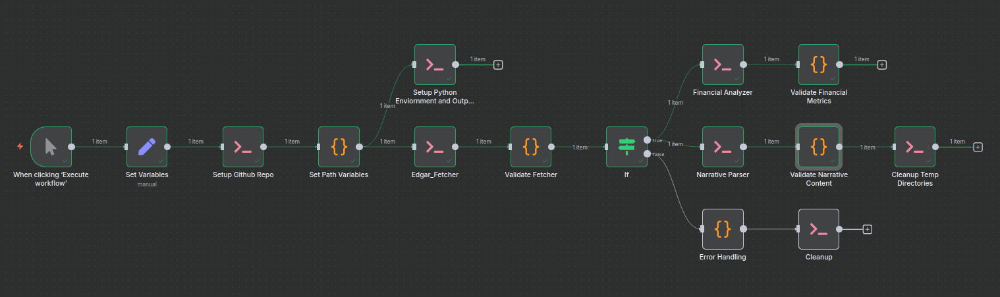

# SEC Filings Analysis Tool

> **Developed by:** Darshan Rajopadhye (rajopadhye.d@northeastern.edu)

[](https://linkedin.com/in/your-linkedin-profile)
[](https://github.com/your-github-username)

## Overview

The SEC Filings Analysis Tool is a specialized component within the Mycroft AI Agent ecosystem that automates the complex process of financial regulatory analysis. This n8n workflow transforms simple stock ticker symbols into comprehensive, actionable business intelligence by systematically processing SEC filings.

As part of the larger Mycroft AI Agent project, this tool serves as a critical financial intelligence component, providing the foundational data and insights that will power broader analytical capabilities and decision-making processes.

## What Does This Workflow Do?

**Input:** A stock ticker symbol (e.g., "AAPL", "TSLA", "MSFT")

**Output:** Complete financial analysis package including:
- Downloaded SEC filings (10-K annual reports, 10-Q quarterly reports, 8-K reports)
- Extracted financial metrics and ratios
- Parsed narrative insights from company disclosures
- Structured data ready in json format



## Information Flow

```
Stock Ticker (AAPL) 
    ↓
SEC EDGAR Database → Download Latest Filings
    ↓
Raw HTML/XML Filings
    ↓
┌─────────────────┬─────────────────┐
│   Financial     │    Narrative    │
│   Analysis      │    Analysis     │
│                 │                 │
│ • Revenue       │ • Risk Factors  │
│ • Profit        │ • MD&A          │
│ • Ratios        │ • Business      │
│ • Trends        │   Overview      │
└─────────────────┴─────────────────┘
    ↓
Structured JSON Output + Analysis Reports
```

## Workflow Stages

> **Note:** This workflow utilizes custom Python scripts developed for financial analysis. View the complete script collection at: [📂 GitHub Repository - Financial Analysis Scripts](https://github.com/Humanitariansai/Mycroft/tree/main/Core_Components/Financial-Metrics-Agent)

### Stage 1: Input & Configuration
**What happens:** The workflow starts when you click "Execute"
- **Input required:** Stock ticker symbol (defaults to AAPL)
- **Configuration set:** User agent, repository location, output paths
- **Information flow:** Ticker symbol → Workflow configuration

### Stage 2: Resource Preparation  
**What happens:** Sets up the analysis environment
- **Downloads:** Latest analysis scripts from GitHub repository
- **Installs:** Required Python libraries and dependencies  
- **Creates:** Temporary workspace directories
- **Information flow:** Configuration → Ready analysis environment

### Stage 3: SEC Data Acquisition
**What happens:** Fetches official company filings
- **Connects to:** SEC EDGAR database using your ticker
- **Downloads:** Most recent 10-K (annual) and 10-Q (quarterly) reports
- **Validates:** File integrity and format compliance
- **Information flow:** Ticker → SEC filings (HTML/XML documents)


### Stage 4: Financial Data Extraction
**What happens:** Converts filing documents into quantitative metrics
- **Processes:** Balance sheets, income statements, cash flow statements  
- **Calculates:** Financial ratios, growth rates, performance indicators
- **Generates:** Trend analysis and comparative metrics
- **Information flow:** SEC filings → Financial metrics JSON

### Stage 5: Narrative Content Analysis  
**What happens:** Extracts qualitative business insights
- **Parses:** Management Discussion & Analysis (MD&A) sections
- **Extracts:** Risk factors, business strategy, market conditions
- **Analyzes:** Key business themes and forward-looking statements
- **Information flow:** SEC filings → Narrative insights JSON


## Input Requirements

| Input Type | Required | Default | Description |
|------------|----------|---------|-------------|
| **Stock Ticker** | Yes | AAPL | Valid NYSE/NASDAQ symbol |
| **User Contact** | Yes | Pre-configured | SEC requires contact info |
| **Github Repository** | Yes | Pre-configured | The workflow uses python scripts hosted on project repository |
| **Script Path** | Yes | Pre-configured | Required to navigate repository structure |

## Output Deliverables

### Financial Analysis Package
```
📊 Financial Metrics
├── Revenue analysis (growth, seasonality)
├── Profitability ratios (margins, ROE, ROA)  
├── Liquidity metrics (current ratio, quick ratio)
├── Leverage analysis (debt ratios, coverage)
└── Efficiency measures (asset turnover, inventory)
```

### Narrative Intelligence Package  
```
📖 Business Insights
├── Risk factor analysis
├── Strategic priorities and initiatives
├── Market condition assessments
├── Management outlook and guidance
└── Regulatory and competitive landscape
```